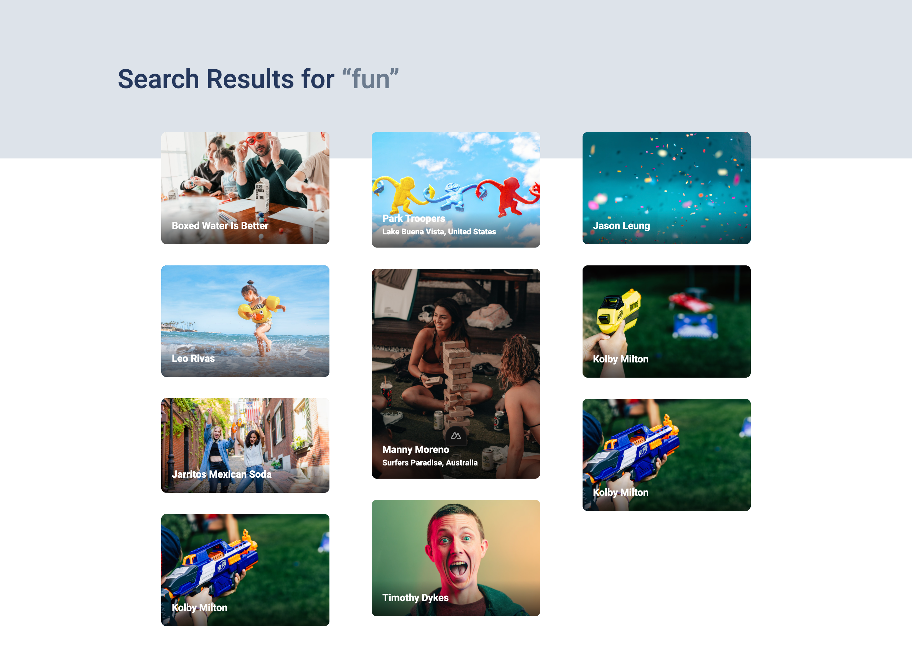

# Unsplash Clone Built with NuxtJS

This is a simple project which takes advantage of the server rendering of NuxtJS and scoped SCSS. There is a focus on making the project lightweight and simple. Uses as much html as possible to avoid relying two much on javascript.

```bash
# install dependencies
$ npm install

# serve with hot reload at localhost:3000
$ npm dev

# build for production and launch server
$ npm build
$ npm start
```

## Live Demo
There is an online demo [here](https://unsplash-clone-ten.vercel.app/)




